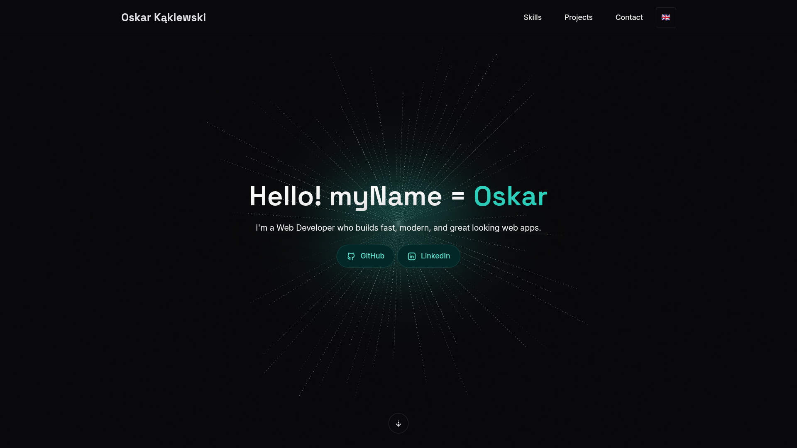
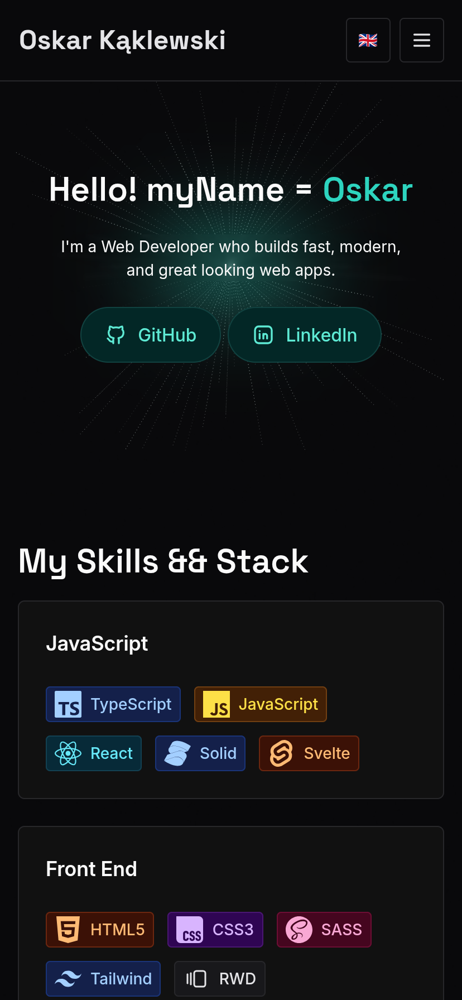

# My Web Developer Portfolio

Personal portfolio website built as a modern, fast, and accessible showcase of my work as a web developer.  
The site presents selected projects, skills, and contact information, with a strong focus on clean UI, performance, and maintainability.

## Live Demo

[View Live Demo](https://kaklewski.pl)

## Screenshots

### Desktop view

<p align="center">
  
</p>

### Mobile view

<p align="center">
  
</p>

## Features

- **Project showcase** – curated list of selected projects with descriptions and links.
- **Internationalization (i18n)** – multi-language support using `i18next`.
- **Responsive design** – fully responsive layout optimized for desktop and mobile devices.
- **Accessible UI** – focus on semantic HTML, contrast, and keyboard navigation.
- **Fast performance** – optimized build powered by Vite.

## Tech Stack

**Core:**

- [Vite](https://vitejs.dev/)
- [React](https://react.dev/)
- [TypeScript](https://www.typescriptlang.org/)

**UI & styling:**

- [Chakra UI](https://chakra-ui.com/) – component library and theming
- [Tabler Icons](https://tabler.io/icons)
- [React Icons](https://react-icons.github.io/react-icons/)
- [Simple Icons](https://simpleicons.org/)

**Internationalization:**

- [i18next](https://www.i18next.com/)
- [react-i18next](https://react.i18next.com/)
- [i18next-browser-languagedetector](https://github.com/i18next/i18next-browser-languageDetector)

**Tooling & quality:**

- [ESLint](https://eslint.org/) + TypeScript ESLint
- [Prettier](https://prettier.io/)
- [Husky](https://github.com/typicode/husky) + lint-staged for pre-commit checks

## Getting Started

Follow these steps to run the project locally.

1. Clone the repository

```bash
git clone https://github.com/kaklewski/kaklewski.pl.git
```

2. Enter the project folder

```bash
cd kaklewski.pl
```

3. Install dependencies

```bash
npm install
```

4. Start the development server (Vite defaults to http://localhost:5173)

```bash
npm start
```

Build for production

```bash
npm run build
```

Preview the production build

```bash
npm run preview
```
